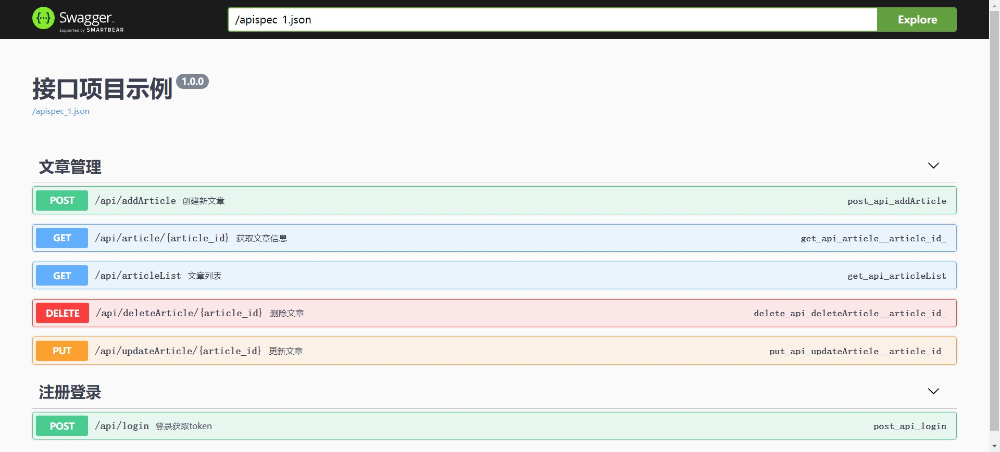

# 接口自动化测试框架

## 技术栈
 🎨 Python3.8（及以上稳定版本） 
 🏐 Pytest（用例编排执行） 
 ☕ Redis（存储变量） 
 🚚 Mysql（存储用例） 
 ⚽ Allure（报告插件）

## 框架优势

<table>
<tr>
    <td>✅ 高度封装，极大缩减使用者的用例代码量</td>
</tr>
<tr>
    <td>✅ 提供示例接口，方便使用者理解和实操</td>
</tr>
<tr>
    <td>✅ 历史接口用例可复用，减少用例冗余</td>
</tr>
<tr>
    <td>✅ Mysql+Redis组合搭配，方便管理用例及后续数据统计</td>
</tr>
</table>

## 注意 
> info.yaml、mysql.yaml、redis.yaml、用例表.project_name字段的项目命名必须保持一致对应
---
# 一、目录结构

    |--接口自动化测试框架 # 主目录
       ├─ api # 示例接口目录
         └─ flaskApi.py # flask示例接口
       ├─ core # 封装调用主入口，requests调用、解析等核心方法
       ├─ util # 常用工具，操作mysql、redis、log、yaml等操作
       ├─ conf # 配置文件读取
         └─ config.ini #项目配置
         └─ info.yaml #接口相关配置 如接口前缀地址
         └─ mysql.yaml #mysql连接信息
         └─ redis.yaml #redis连接信息
       ├─ testcase # 测试相关文件
         └─ testcase 用例代码
           └─ caseBlog 示例项目文件
             └─ test_blog.py
           └─ caseLogin   登录项目文件
             └─ test_login.py
       ├─ report # 测试结果
         └─ allure_report #allure报告文件
         └─ logs #日志
       ├─ conftest.py	   # 用例的设置和清理
       ├─ pytest.ini	   # pytest配置
       ├─ requirements.txt # 记录所有依赖包及其精确的版本号
       └─ README.md
# 二、框架流程图

# 三、环境配置
安装好mysql和redis后，请启动对应服务保证能连接成功
## 1、安装mysql
以下为windows系统安装，其他系统请自行查找安装教程
https://www.jianshu.com/p/5d1ce588e18c

## 2、安装redis
请自行查找安装教程，并设置秘钥

    # 打开解压后的Redis目录，找到redis.windows.conf文件，使用文本编辑器打开，并找到包含“requirepass”的行，去掉行前的注释符号#，并设置你的密钥
    requirepass yourpassword
    # 启动Redis服务
    redis-server.exe redis.windows.conf

## 3、配置python环境
安装python后，使用如下命令安装依赖包`pip install -r requirements.txt`
    
    dingtalkchatbot：需要离线安装，离线包下载地址：https://github.com/zhuifengshen/DingtalkChatbot，
    下载后进到所在目录执行命令python3 setup.py install
    
    PyYAML：当执行用例报错module 'yaml' has no attribute 'FullLoader' ---先卸载pyyaml，
    再使用命令pip install --ignore-installed PyYAML重新安装
# 四、部署示例接口
运行api/flaskApi.py文件启动flask服务，此示例接口用于后续演示调试，打开`http://127.0.0.1:5000/apidocs/`
可查看接口文档

注：接口前缀使用`http://127.0.0.1:5000`，可使用接口工具请求接口验证是否正常

# 五、如何编写用例
### 1、录入配置
#### 1）config.ini
    根据自身需求配置信息

#### 2）conf/info.yaml

    根据自身需求，可配置多个项目多个环境的接口前缀地址

#### 3）conf/mysql.yaml

    根据自身需求设置连接信息
    用例mysql：建议所有环境使用一个数据库，命名CaseDb不用修改
    业务mysql：可配置多个项目多个环境的mysql连接信息，项目名根据自身需求进行修改

#### 4）conf/redis.yaml

    根据自身需求设置连接信息
    用例redis：建议所有环境使用一个数据库，命名CaseDb不用修改
    业务redis：可配置多个项目多个环境的redis连接信息，项目名根据自身需求进行修改

### 2、创建用例表
此处创建两张表，分别为`base_login`（存放登录接口）和`article`（用例表，可自行命名），以下是创建sql：

    CREATE TABLE `base_login` (
      `case_id` varchar(50) CHARACTER SET utf8mb4 COLLATE utf8mb4_0900_ai_ci DEFAULT NULL COMMENT '用例id，建议用自己名字命名便于区分，如zmm-1.0',
      `creator` varchar(255) DEFAULT NULL COMMENT '创建人',
      `project_name` varchar(65) DEFAULT 'BlogProject' COMMENT '项目名称，如BlogProject',
      `case_module` varchar(255) DEFAULT NULL COMMENT '需求名称或者模块名称',
      `case_name` varchar(255) DEFAULT NULL COMMENT '用例名称',
      `api_way` varchar(32) DEFAULT 'POST' COMMENT '请求方式(GET、POST、PUT、DELETE)',
      `headers` longtext COMMENT '请求头',
      `case_url` varchar(255) DEFAULT NULL COMMENT '接口地址，只需要写路由后的地址',
      `case_param` longtext COMMENT '接口传参',
      `assert_settings` varchar(255) DEFAULT NULL COMMENT '断言类型',
      `assert` longtext COMMENT '断言内容',
      `prepose_control` longtext COMMENT '前置全局变量，接口请求前需要做的前置动作',
      `postpose_control` longtext COMMENT '后置全局变量，接口请求后需要的数据，如断言所需的变量提取，之后接口所需的参数',
      `relevance_page` varchar(255) DEFAULT NULL COMMENT '对应的功能页面地址，便于其他人查找',
      `developer` varchar(255) DEFAULT NULL COMMENT '接口开发者',
      `created_time` date DEFAULT NULL COMMENT '接口创建时间',
      `text` longtext COMMENT '备注',
      `is_deleted` int DEFAULT '0'
    ) ENGINE=InnoDB DEFAULT CHARSET=utf8mb4 COLLATE=utf8mb4_0900_ai_ci COMMENT='登录用例';

    CREATE TABLE `article` (
      `case_id` varchar(50) DEFAULT NULL COMMENT '用例id，建议用自己名字命名便于区分，如zmm-1.0',
      `creator` varchar(255) DEFAULT NULL COMMENT '创建人',
      `project_name` varchar(65) DEFAULT 'BlogProject' COMMENT '项目名称，如BlogProject',
      `case_module` varchar(255) DEFAULT NULL COMMENT '需求名称或者模块名称',
      `case_name` varchar(255) DEFAULT NULL COMMENT '用例名称',
      `api_way` varchar(32) DEFAULT 'POST' COMMENT '请求方式(GET、POST、PUT、DELETE)',
      `headers` longtext COMMENT '请求头',
      `case_url` varchar(255) DEFAULT NULL COMMENT '接口地址，只需要写路由后的地址',
      `case_param` longtext COMMENT '接口传参',
      `assert_settings` varchar(255) DEFAULT NULL COMMENT '断言类型',
      `assert` longtext COMMENT '断言内容',
      `prepose_control` longtext COMMENT '前置全局变量，接口请求前需要做的前置动作',
      `postpose_control` longtext COMMENT '后置全局变量，接口请求后需要的数据，如断言所需的变量提取，之后接口所需的参数',
      `relevance_page` varchar(255) DEFAULT NULL COMMENT '对应的功能页面地址，便于其他人查找',
      `developer` varchar(255) DEFAULT NULL COMMENT '接口开发者',
      `created_time` date DEFAULT NULL COMMENT '接口创建时间',
      `text` longtext COMMENT '备注',
      `is_deleted` int DEFAULT '0'
    ) ENGINE=InnoDB DEFAULT CHARSET=utf8mb4 COLLATE=utf8mb4_0900_ai_ci COMMENT='文章接口用例';

### 3、录入用例数据
#### 1）录入登录接口数据
调用业务接口要维持登录状态，如果是从登录接口获取token，需要在用例mysql的`base_login`表配置登录接口，
并在`postpose_control`字段写入存储token的语法。后续只需将存储的对应key名，填入其他接口的`headers`字段内即可。
以下为示例sql：
    
    INSERT INTO base_login
    (case_id, creator, project_name, case_module, case_name, api_way, headers, case_url, case_param, assert_settings, assert, prepose_control, postpose_control, relevance_page, developer, created_time, `text`, is_deleted)
    VALUES('zmm-1.0', '张某某', 'BlogProject', '登录', '账密登录成功', 'POST', NULL, '/api/login', '{"username":"test","password":"123456"}', NULL, '包含&&{"code":"200","data":"9779dd9e-aa3d-435f-a431-e699a67fe616","message":"登录成功！","success":true}&&', NULL, 'BlogProject_token=jsonpath_rela.data', NULL, '开发者', '2023-03-10', NULL, 0);

#### 2）录入接口用例数据
注意headers字段需要添加对应项目token的变量key名，保证登录。以下为示例sql：
    
    INSERT INTO article
    (case_id, creator, project_name, case_module, case_name, api_way, headers, case_url, case_param, assert_settings, assert, prepose_control, postpose_control, relevance_page, developer, created_time, `text`, is_deleted)
    VALUES('zmm-1.0', '张某某', 'BlogProject', '文章管理', '文章列表', 'GET', 'token=##BlogProject_token##', '/api/articleList', NULL, NULL, '包含&&{"code":"200","data":[{"content":"长风破浪会有时，直挂云帆济沧海。","id":1,"title":"行路难"},{"content":"沉舟侧畔千帆过，病树前头万木春。","id":2,"title":"酬乐天扬州初逢席上见赠"}],"success":true}&&', NULL, NULL, NULL, '开发者', '2023-03-10', NULL, 0);
    INSERT INTO article
    (case_id, creator, project_name, case_module, case_name, api_way, headers, case_url, case_param, assert_settings, assert, prepose_control, postpose_control, relevance_page, developer, created_time, `text`, is_deleted)
    VALUES('zmm-1.1', '张某某', 'BlogProject', '文章管理', '新增文章', 'POST', 'token=##BlogProject_token##', '/api/addArticle', '{"id":3, "title":"芙蓉楼送辛渐", "content":"洛阳亲友如相问，一片冰心在玉壶。"}', NULL, '包含&&{"code":"200","message":"添加新文章成功！","success":true}&&', 'sleep2', 'mysql_1.test_cases.zmm_case_name=select case_name from base_login where case_id=''zmm-1.0''', NULL, '开发者', '2023-03-10', NULL, 0);
    INSERT INTO article
    (case_id, creator, project_name, case_module, case_name, api_way, headers, case_url, case_param, assert_settings, assert, prepose_control, postpose_control, relevance_page, developer, created_time, `text`, is_deleted)
    VALUES('zmm-1.2', '张某某', 'BlogProject', '文章管理', '查看新增的文章', 'GET', 'token=##BlogProject_token##', '/api/article/3', NULL, NULL, '包含&&{"code":"200","data":{"content":"洛阳亲友如相问，一片冰心在玉壶。","id":3,"title":"芙蓉楼送辛渐"},"success":true}&&', NULL, NULL, NULL, '开发者', '2023-03-10', NULL, 0);
    INSERT INTO article
    (case_id, creator, project_name, case_module, case_name, api_way, headers, case_url, case_param, assert_settings, assert, prepose_control, postpose_control, relevance_page, developer, created_time, `text`, is_deleted)
    VALUES('zmm-1.3', '张某某', 'BlogProject', '文章管理', '编辑新增的文章', 'PUT', 'token=##BlogProject_token##', '/api/updateArticle/3', '{"title":"新-芙蓉楼送辛渐", "content":"洛阳亲友如相问，一片冰心在玉壶。"}', NULL, '包含&&{"code":"200","message":"更新文章信息成功！","success":true}&&', NULL, NULL, NULL, '开发者', '2023-03-10', NULL, 0);
    INSERT INTO article
    (case_id, creator, project_name, case_module, case_name, api_way, headers, case_url, case_param, assert_settings, assert, prepose_control, postpose_control, relevance_page, developer, created_time, `text`, is_deleted)
    VALUES('zmm-1.4', '张某某', 'BlogProject', '文章管理', '删除新增的文章', 'DELETE', 'token=##BlogProject_token##', '/api/deleteArticle/3', NULL, NULL, '包含&&{"code":"200","message":"删除文章成功！","success":true}&&', NULL, 'apiCase.article=zmm-1.0', NULL, '开发者', '2023-03-10', NULL, 0);

### 5、编写用例代码
在testcase目录下，创建编写用例代码，修改类和方法名避免冲突，再填写用例数据所在的表和用例id（调用多条用例，可写为zmm-1.0#zmm-1.3），
如下创建./testcase/caseBlog/case_blog.py。

🎉 `后续用例只需要复制此代码，修改下类/方法名/parameterization_data传参即可`
    
    from app.core.methods import *
    
    @allure.epic("测试用例")
    @allure.feature("博客项目")
    @pytest.mark.skipif(env in ['RELEASE'], reason='线上环境不执行')
    class TestExample():

        @login_decorator
        def setup_class(self):
            Log().debug('----------------------【测试用例开始执行】----------------------')
    
        @allure.story("文章管理")
        @allure.title('{title}')
        @pytest.mark.parametrize('case_id, title, table_name', MysqlConstructor.parameterization_data('article', 'zmm-1.0#zmm-1.4'))
        def test_example(self, case_id, title, table_name):
            Genetator.global_generator(table_name=table_name, case_id=case_id)
    
        def teardown_class(self):
            Log().debug('-----------------------【测试用例执行完毕】-----------------------\n')

🎉 parameterization_data()内的用例id详细写法说明如下

    调用单条用例写法
    MysqlConstructor.parameterization_data('baseprocess', 'back-zmm-1.0')

    调用多条用例写法
    MysqlConstructor.parameterization_data('baseprocess', 'back-zmm-1.0#back-zmm-1.2')
    此写法会调用back-zmm-1.0、back-zmm-1.1、back-zmm-1.2共3条用例

    调用分离的多条用例写法
    MysqlConstructor.parameterization_data('baseprocess', 'back-zmm-1.0#back-zmm-1.2,back-zmm-1.5#back-zmm-1.7')
    此写法会调用back-zmm-1.0、back-zmm-1.1、back-zmm-1.2、back-zmm-1.5、back-zmm-1.6、back-zmm-1.7共6条用例

# 六、运行用例
### 1、运行方式1
使用pytest命令，此处在项目根目录命令行输入`pytest .\testcase\caseBlog\case_blog.py`执行

### 2、运行方式2
或者pycharm选择用例代码文件（如`case_blog.py`）运行

# 七、查看报告
## 1、windows系统配置allure
本地运行完后，可以安装allure来看报告
### 1）下载allure
https://github.com/allure-framework/allure2/releases，下载zip文件并解压

### 2）配置jdk环境
自行百度
### 3）配置环境变量
将allure的bin目录添加到系统环境变量下，配置完成后在命令窗口输入allure验证是否配置成功

### 4）运行本地生成的报告
报告文件上层目录下，输入allure serve 报告文件名称，执行

### 5）查看报告
打开浏览器查看报告

---

---
# 语法格式及详细写法
> ## mysql用例表字段有各自可支持的写法，提升用例的灵活程度
## 1、headers字段
多个数据间用中文分号`；`隔开，`##`内为变量将从redis取出替换，示例如下

`aa=11；token=##zmm_id##`  
### 1）从用例redis获取变量值

| redis中value数据类型 | key  | value |
|-----------------|------|-------|
| 字符串             | zmm_id | zhang00  |
| 字典              | zmm_id | {'aa': 'zhang00'}  |
| 数组              | zmm_id | [{'aa': 'zhang00'}, {'bb': 'zhang11'}] |
    当value值数据类型为字符串时，写法：##zmm_id##

    当value值数据类型为字典时，写法：##zmm_id.aa##

    当value值数据类型为数组时，写法：##zmm_id.1.aa## 或 ##zmm_id.2.bb##

## 2、case_url字段
双`##`内为变量将从redis取出替换，示例如下

`/transbiz_2c/user/getFsUserIdByUserId.run?userId=##zmm_userId##`  
### 1）从用例redis获取变量值
    具体写法前面已介绍，不再具体概述

### 2）特殊变量值
可插入任意位置

    时间格式变量：
        当接口传参需要依赖当前时间时，可以直接使用以下写法
        {{秒截止+2m}} ---秒截止表示精确到秒，2m表示当前时间加2分钟，如2021-04-12 15:36:44
        {{秒截止-2m}} ---秒截止表示精确到秒，2m表示当前时间减2分钟
        {{秒截止+2h}} ---秒截止表示精确到秒，2h表示当前时间加2小时
        {{秒截止+2d}} ---秒截止表示精确到秒，2d表示当前时间加2天
        {{秒截止+2M}} ---秒截止表示精确到秒，2M表示当前时间加2个月
        {{秒截止+2Y}} ---秒截止表示精确到秒，2Y表示当前时间加2年
        {{分截止+2m}} ---秒截止表示精确到分，2m表示当前时间加2分钟，如2021-04-12 15:36
        ........
        {{日截止+2d}} ---秒截止表示精确到天，2d表示当前时间加2天，如2021-04-12
        ........
        {{月截止-2M}} ---秒截止表示精确到月，2M表示当前时间减2个月，如2021-04
        ........
        {{年截止-2Y}} ---秒截止表示精确到年，2Y表示当前时间减2年，如2019
        ........

    随机手机号：
        当传参中需要随机手机号的，可以使用以下写法   {{mobile}}，如想插入redis全局变量可写成{{zmm_xxx.mobile}}
    
    指定长度随机数：
        当需要传5位随机数，可以使用以下写法 {{number5}}，如想插入redis全局变量可写成{{zmm_xxx.number5}}
    
    指定范围随机数：
        当需要传指定数字区间的随机数，可以使用以下写法  {{number12-88}}

## 3、case_param字段
双`##`内为变量将从redis取出替换，示例如下

`{"userId": ##zmm_userId##,"agreementSource": 20}`  
### 1）从用例redis获取变量值
    具体写法前面已介绍，不再具体概述

## 4、prepose_control字段
接口请求前的前置操作，可以执行操作业务数据库、操作业务redis、调用存量用例、存储自定义变量数据、强制等待特殊变量值，示例如下

`apiCase.base_login=zmm-1.1；
zmm_id=jsonpath_rela.id；
zmm_id=jsonpath_abs.data.0.id；
mysql_1.db_name.zmm_id=select id from user_basic where code = 'xxx'；
redis.0.zmm_id=hash.select.name.key；
custom.zmm_token=da173228-29b3-40c0-b9b0-04b364756c91；`  
### 1）调用存量用例
    写法：apiCase.表名=用例id（调用单条用例）
    示例：apiCase.base_login=zmm-1.1
    调用base_login表内，case_id为zmm-1.1的用例
    
    写法：apiCase.表名=用例id#用例id（调用多条用例）
    示例：apiCase.base_login=zmm-1.1#zmm-1.3
    调用base_login表内，case_id为zmm-1.1、zmm-1.2、zmm-1.3的用例

### 2）操作业务mysql
    写法：mysql_库索引.库名.redis的key命名=sql语句（查询操作）
    示例：mysql_1.user_basic.zmm_id=select id from user_basic where user_id='12345'
    库索引取自mysql.yaml的business_db数字后缀，因为会存在多个数据库不同的连接信息。
    执行sql后查询到id值，命名zmm_id为key，存储至redis中

    写法：mysql_库索引.库名.redis的key命名=sql语句（插入、更新、删除操作）
    示例：mysql_1.user_basic.zmm_id=update user_basic set user_name='测试' where user_id='12345'
    库索引取自mysql.yaml的business_db数字后缀，因为会存在多个数据库不同的连接信息。
    执行插入、更新、删除操作不同于查询操作，不会存储变量值

    写法：mysql_库索引.库名.redis的key命名=sql语句（存在####）
    示例：mysql_1.user_basic.zmm_id=select id from user_basic where user_id='##user_id##'
    此写法新增了从redis获取变量值，然后再去直接mysql查询操作，执行sql后查询到id值，命名zmm_id为key，存储至redis中

### 3）操作业务redis
redis有多种数据类型，语法会相对较多。仅查询操作会存储变量值
#### 字符串数据类型
    写法：redis.库索引.redis的key命名=str.select.key.value（新增操作）
    示例：redis.1.zmm_id=str.add.id.100
    库索引为了指定具体库（redis默认16个库），向业务redis新增key为id，value为100的字符串数据

    写法：redis.库索引.redis的key命名=str.select.key（查询操作）
    示例：redis.1.zmm_id=str.add.id
    从业务redis查询key为id的值，命名zmm_id为key，存储至redis中

    写法：redis.库索引.redis的key命名=str.delete.key（删除操作）
    示例：redis.1.zmm_id=str.delete.id
    向业务redis删除key为id的数据

#### 哈希数据类型
    写法：redis.库索引.redis的key命名=hash.add.key.name.value（新增/编辑操作）
    示例：redis.1.zmm_id=hash.add.data.id.100
    库索引为了指定具体库（redis默认16个库），向业务redis新增/编辑key为data，name为id，value为100的哈希数据

    写法：redis.库索引.redis的key命名=hash.select.key.name（查询操作）
    示例：redis.1.zmm_id=hash.select.data.id
    从业务redis查询key为data，name为id的值，命名zmm_id为key，存储至redis中

    写法：redis.库索引.redis的key命名=hash.delete.key.name（删除操作）
    示例：redis.1.zmm_id=hash.delete.data.id
    向业务redis删除key为data，name为id的数据

#### 列表数据类型
    写法：redis.库索引.redis的key命名=list.ladd.key.name（头部新增操作）
    示例：redis.1.zmm_id=list.ladd.id.100
    库索引为了指定具体库（redis默认16个库），向业务redis新增key为id，value为100的字符串数据
    当数据存在时，从列表头部新增此数据
    
    写法：redis.库索引.redis的key命名=list.radd.key.name（尾部新增操作）
    示例：redis.1.zmm_id=list.radd.id.100
    库索引为了指定具体库（redis默认16个库），向业务redis新增key为id，value为100的字符串数据
    当数据存在时，从列表尾部新增此数据

    写法：redis.库索引.redis的key命名=list.select.key.2（查询操作）
    示例：redis.1.zmm_id=list.select.id.2
    从业务redis查询key为id，第2个值，命名zmm_id为key，存储至redis中

### 4）强制等待操作
    写法：sleep5
    强制等待5秒

### 5）存储自定义变量数据
    写法：custom.redis的key命名=自定义值
    custom.zmm_token=da173228-29b3-40c0-b9b0-04b364756c91
    向redis存储key为zmm_token，value为da173228-29b3-40c0-b9b0-04b364756c91的数据

### 6）特殊变量值
    
    具体写法前面已介绍，不再具体概述
## 5、assert字段
多重断言，使用中文`；`隔开，示例如下

`包含&&{'cardNo':'202305271262994896'}&&；相等(排序生效;类型生效)&&{'id': 11}&&`  
### 1）相等校验
    写法：相等&&{'cardNo':'202305271262994896'}&&（不校验字段顺序和字段字母大小写）
    $$内的期望值和响应实际值全部一致时，断言成功；有不一致的地方，则断言失败

    写法：相等(排序生效;类型生效)&&{'cardNo':'202305271262994896'}&&（校验字段顺序和字段字母大小写）
    $$内的期望值和响应实际值全部一致时，断言成功；有不一致的地方，则断言失败

### 2）包含校验
    写法：包含&&{'cardNo':'202305271262994896'}&&（不校验字段顺序和字段字母大小写）
    响应实际值完全包含$$内的期望值时，断言成功；有不包含的地方，则断言失败

    写法：包含(排序生效;类型生效)&&{'cardNo':'202305271262994896'}&&（校验字段顺序和字段字母大小写）
    响应实际值完全包含$$内的期望值时，断言成功；有不包含的地方，则断言失败

## 6、postpose_control字段
接口请求后的前置操作，可以执行存储接口响应值、调用其他用例、操作业务mysql、操作业务redis、调用存量用例、存储自定义变量数据、强制等待、特殊变量值，示例如下

`apiCase.base_login=zmm-1.1；
zmm_id=jsonpath_rela.id；
zmm_id=jsonpath_abs.data.0.id；
mysql_1.db_name.zmm_id=select id from user_basic where code = 'xxx'；
redis.0.zmm_id=hash.select.name.key；
custom.zmm_token=da173228-29b3-40c0-b9b0-04b364756c91；`
### 1）存储接口响应值
    写法：redis的key命名=jsonpath_rela.响应中的字段名
    示例：zmm_id=jsonpath_rela.id
    jsonpath_rela表示使用相对路径查找接口响应中字段名为id的值，命名zmm_id为key，存储至redis中

    写法：redis的key命名=jsonpath_rela.响应中的字段名.索引
    示例：zmm_id=jsonpath_rela.id.2
    jsonpath_rela表示使用相对路径查找接口响应中字段名为id的值，当查找到多个值仅获取第2个值，命名zmm_id为key，存储至redis中
    
    写法：redis的key命名=jsonpath_abs.响应中的字段名
    示例：zmm_id=jsonpath_abs.data.0.id
    jsonpath_abs表示使用绝对路径data.0.id逐层查找接口响应中的字段值，命名zmm_id为key，存储至redis中
### 2）调用存量接口
    
    具体写法前面已介绍，不再具体概述
### 3）操作业务mysql
    
    具体写法前面已介绍，不再具体概述
### 4）操作业务redis

    具体写法前面已介绍，不再具体概述
### 5）强制等待操作
    
    具体写法前面已介绍，不再具体概述
### 6）存储自定义变量数据
    
    具体写法前面已介绍，不再具体概述
### 7）特殊变量值

    具体写法前面已介绍，不再具体概述

## 7、is_deleted字段
    代表是否删除。为0时，调用此用例会执行；为1时，调用此用例不会执行

